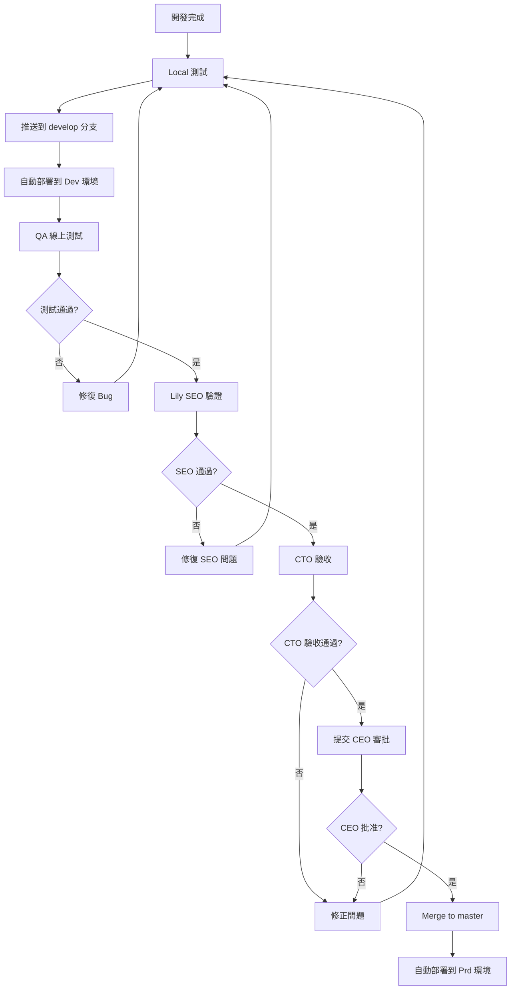

# 技術設計文檔 - CloudTools AI 工具平台

**版本**: 1.0
**日期**: 2025-10-26
**狀態**: 待 CTO 審核
**專案**: CloudTools AI 工具平台 (tools.cloudto.io)

---

## 1. 系統架構設計

### 1.1 整體架構

```
┌─────────────────────────────────────────────────────────┐
│                     Cloudflare CDN                      │
│              (Edge Cache + SSL + DDoS)                  │
└───────────────────┬─────────────────────────────────────┘
                    │
        ┌───────────┴───────────┐
        │                       │
┌───────▼──────┐      ┌────────▼────────┐
│ Dev Environment│      │ Prd Environment │
│ devtools.     │      │ tools.          │
│ cloudto.io    │      │ cloudto.io      │
│ (develop)     │      │ (master)        │
└───────┬──────┘      └────────┬────────┘
        │                      │
        └──────────┬───────────┘
                   │
        ┌──────────▼──────────┐
        │   Next.js 15 App    │
        │   (App Router)      │
        ├─────────────────────┤
        │ - SSR + SSG         │
        │ - ISR (60s)         │
        │ - Edge Functions    │
        └──────────┬──────────┘
                   │
        ┌──────────▼──────────┐
        │  Frontend Stack     │
        ├─────────────────────┤
        │ - React 19 RC       │
        │ - TypeScript 5.7    │
        │ - Tailwind CSS 4    │
        │ - Radix UI          │
        │ - @dnd-kit/core     │
        │ - Zustand 5         │
        └─────────────────────┘
```

### 1.2 技術棧選型

**前端框架**:
- **Next.js 15** (App Router) - SSR/SSG/ISR 支持
- **React 19 RC** - 最新並發特性
- **TypeScript 5.7** - 完整類型安全

**UI 與樣式**:
- **Tailwind CSS 4** - Utility-first CSS
- **Radix UI** - 無障礙組件庫
- **Framer Motion** - 動畫效果
- **Lucide React** - Icon 庫

**狀態管理**:
- **Zustand 5** - 輕量級全局狀態
- **localStorage** - 持久化存儲

**拖放功能**:
- **@dnd-kit/core** - 核心拖放庫
- **@dnd-kit/sortable** - 排序支持
- **@dnd-kit/utilities** - 工具函數

**國際化**:
- **next-intl** - i18n 解決方案
- 支持語言: zh-tw (預設), en, zh-cn, ja

**部署與監控**:
- **Nginx** - 反向代理（VPS: 165.154.226.78）
- **PM2** - 進程管理與自動重啟
- **Cloudflare CDN** - Edge Cache + SSL + DDoS 防護
- **VPS** - Ubuntu 22.04 LTS (2 Core / 4 GB RAM)

---

## 2. Next.js 路由架構

### 2.1 路由結構

```
app/
├── [locale]/                    # 語言路由
│   ├── layout.tsx              # 語言層級 Layout
│   ├── page.tsx                # 首頁 (自動重定向到 /removebg)
│   ├── [tool]/                 # 動態工具路由
│   │   ├── page.tsx            # 工具頁面
│   │   └── layout.tsx          # 工具 Layout
│   ├── not-found.tsx           # 客製化 404 (Coming Soon)
│   └── middleware.ts           # 語言檢測與重定向
├── api/                        # API Routes
│   ├── removebg/route.ts       # 移除背景 API
│   └── health/route.ts         # 健康檢查
├── layout.tsx                  # Root Layout
└── not-found.tsx               # 全局 404
```

### 2.2 路由規則

**首頁重定向**:
```typescript
// app/[locale]/page.tsx
import { redirect } from 'next/navigation';

export default function HomePage({ params }: { params: { locale: string } }) {
  redirect(`/${params.locale}/removebg`);
}
```

**動態工具路由**:
```typescript
// app/[locale]/[tool]/page.tsx
const AVAILABLE_TOOLS = ['removebg']; // 當前支持的工具
const COMING_SOON_TOOLS = ['compress', 'crop', 'convert']; // 即將推出

export default function ToolPage({ params }: { params: { locale: string; tool: string } }) {
  if (AVAILABLE_TOOLS.includes(params.tool)) {
    return <ToolComponent tool={params.tool} />;
  }

  if (COMING_SOON_TOOLS.includes(params.tool)) {
    return <ComingSoonPage tool={params.tool} />;
  }

  notFound(); // 觸發 404
}
```

**語言檢測與重定向**:
```typescript
// middleware.ts
import { NextRequest, NextResponse } from 'next/server';
import createMiddleware from 'next-intl/middleware';

const locales = ['zh-tw', 'en', 'zh-cn', 'ja'];
const defaultLocale = 'zh-tw';

export default createMiddleware({
  locales,
  defaultLocale,
  localePrefix: 'always',
});

export const config = {
  matcher: ['/', '/(zh-tw|en|zh-cn|ja)/:path*'],
};
```

### 2.3 404 頁面設計

**客製化 Coming Soon 404**:
```typescript
// app/[locale]/not-found.tsx
export default function NotFoundPage() {
  return (
    <div className="flex flex-col items-center justify-center min-h-[60vh]">
      <h1 className="text-4xl font-bold mb-4">🚧 Coming Soon</h1>
      <p className="text-lg text-gray-600 mb-8">
        這個工具即將推出，敬請期待！
      </p>
      <Link href="/removebg" className="btn-primary">
        返回移除背景工具
      </Link>
    </div>
  );
}
```

---

## 3. UI 組件設計

### 3.1 NavBar 組件

**位置**: 頂部固定
**功能**: Logo、語言切換、工具導航

**結構**:
```typescript
// components/NavBar.tsx
export default function NavBar() {
  return (
    <nav className="fixed top-0 w-full h-16 bg-white border-b border-gray-200 z-50">
      <div className="container mx-auto flex items-center justify-between px-4 h-full">
        {/* Logo */}
        <Link href="/" className="flex items-center gap-2">
          <Logo className="h-8 w-8" />
          <span className="text-xl font-bold">CloudTools AI</span>
        </Link>

        {/* 桌面端工具導航 */}
        <div className="hidden md:flex items-center gap-6">
          <ToolLinks />
        </div>

        {/* 語言切換器 (右側) */}
        <LanguageSwitcher />
      </div>
    </nav>
  );
}
```

**響應式設計**:
- **桌面端** (≥768px): 完整導航顯示
- **移動端** (<768px): 隱藏工具導航，使用底部 Tab Bar

### 3.2 工具列設計

#### 3.2.1 桌面端工具列（可拖動）

**位置**: 頁面左側
**功能**: 工具切換、拖動排序、收合

**結構**:
```typescript
// components/ToolBar/DesktopToolBar.tsx
import { DndContext, closestCenter } from '@dnd-kit/core';
import { SortableContext, verticalListSortingStrategy } from '@dnd-kit/sortable';

export default function DesktopToolBar() {
  const { tools, reorderTools } = useToolStore();
  const [isCollapsed, setIsCollapsed] = useState(false);

  return (
    <aside className={cn(
      "fixed left-0 top-16 h-[calc(100vh-4rem)] bg-white border-r transition-all duration-300",
      isCollapsed ? "w-16" : "w-64"
    )}>
      <DndContext
        collisionDetection={closestCenter}
        onDragEnd={handleDragEnd}
      >
        <SortableContext items={tools} strategy={verticalListSortingStrategy}>
          {tools.map(tool => (
            <SortableToolItem key={tool.id} tool={tool} isCollapsed={isCollapsed} />
          ))}
        </SortableContext>
      </DndContext>

      {/* 收合按鈕 */}
      <button
        onClick={() => setIsCollapsed(!isCollapsed)}
        className="absolute bottom-4 right-4 p-2 rounded-lg hover:bg-gray-100"
      >
        {isCollapsed ? <ChevronRight /> : <ChevronLeft />}
      </button>
    </aside>
  );
}
```

**拖動效果 (GPU 加速)**:
```css
/* globals.css */
.sortable-item {
  transition: transform 200ms cubic-bezier(0.4, 0, 0.2, 1);
  will-change: transform;
  transform: translateZ(0); /* 強制 GPU 加速 */
}

.sortable-item.dragging {
  opacity: 0.5;
  z-index: 999;
  cursor: grabbing;
}
```

#### 3.2.2 移動端工具列（底部 Tab Bar）

**位置**: 底部固定
**功能**: 工具切換、不可拖動

**結構**:
```typescript
// components/ToolBar/MobileTabBar.tsx
export default function MobileTabBar() {
  const { tools } = useToolStore();
  const pathname = usePathname();

  return (
    <nav className="fixed bottom-0 left-0 right-0 h-16 bg-white border-t border-gray-200 z-50 md:hidden">
      <div className="flex items-center justify-around h-full">
        {tools.map(tool => (
          <Link
            key={tool.id}
            href={`/${tool.slug}`}
            className={cn(
              "flex flex-col items-center gap-1 p-2 rounded-lg transition-colors",
              pathname.includes(tool.slug) ? "text-primary bg-primary/10" : "text-gray-600"
            )}
          >
            <tool.icon className="h-6 w-6" />
            <span className="text-xs">{tool.name}</span>
          </Link>
        ))}
      </div>
    </nav>
  );
}
```

### 3.3 工具列收合功能

**狀態管理**:
```typescript
// stores/toolStore.ts
import { create } from 'zustand';
import { persist } from 'zustand/middleware';

interface ToolStore {
  tools: Tool[];
  isCollapsed: boolean;
  reorderTools: (activeId: string, overId: string) => void;
  toggleCollapse: () => void;
}

export const useToolStore = create<ToolStore>()(
  persist(
    (set) => ({
      tools: INITIAL_TOOLS,
      isCollapsed: false,
      reorderTools: (activeId, overId) => {
        set((state) => {
          const oldIndex = state.tools.findIndex(t => t.id === activeId);
          const newIndex = state.tools.findIndex(t => t.id === overId);
          return { tools: arrayMove(state.tools, oldIndex, newIndex) };
        });
      },
      toggleCollapse: () => set((state) => ({ isCollapsed: !state.isCollapsed })),
    }),
    { name: 'tool-storage' }
  )
);
```

**收合狀態**:
- **展開** (w-64): 顯示完整工具名稱
- **收合** (w-16): 僅顯示圖標
- **持久化**: localStorage 保存收合狀態

---

## 4. 狀態管理設計

### 4.1 Zustand Store 架構

```typescript
// stores/index.ts
export { useToolStore } from './toolStore';
export { useImageStore } from './imageStore';
export { useUIStore } from './uiStore';

// stores/imageStore.ts
interface ImageStore {
  originalImage: File | null;
  processedImage: string | null;
  isProcessing: boolean;
  error: string | null;
  setOriginalImage: (file: File) => void;
  setProcessedImage: (url: string) => void;
  setProcessing: (status: boolean) => void;
  setError: (error: string | null) => void;
  reset: () => void;
}

export const useImageStore = create<ImageStore>((set) => ({
  originalImage: null,
  processedImage: null,
  isProcessing: false,
  error: null,
  setOriginalImage: (file) => set({ originalImage: file }),
  setProcessedImage: (url) => set({ processedImage: url }),
  setProcessing: (status) => set({ isProcessing: status }),
  setError: (error) => set({ error }),
  reset: () => set({
    originalImage: null,
    processedImage: null,
    isProcessing: false,
    error: null,
  }),
}));
```

### 4.2 localStorage 持久化

**持久化策略**:
- **工具排序**: `tool-storage` (Zustand persist)
- **用戶偏好**: `user-preferences` (語言、主題)
- **不持久化**: 圖片處理狀態 (安全性考量)

```typescript
// utils/localStorage.ts
export const STORAGE_KEYS = {
  TOOLS: 'tool-storage',
  PREFERENCES: 'user-preferences',
} as const;

export function getStorageItem<T>(key: string, defaultValue: T): T {
  if (typeof window === 'undefined') return defaultValue;

  try {
    const item = window.localStorage.getItem(key);
    return item ? JSON.parse(item) : defaultValue;
  } catch (error) {
    console.error('localStorage get error:', error);
    return defaultValue;
  }
}
```

---

## 5. 拖放功能設計

### 5.1 @dnd-kit 配置

```typescript
// components/ToolBar/DraggableToolList.tsx
import { DndContext, DragEndEvent, closestCenter } from '@dnd-kit/core';
import { SortableContext, verticalListSortingStrategy, useSortable } from '@dnd-kit/sortable';
import { CSS } from '@dnd-kit/utilities';

function SortableToolItem({ tool, isCollapsed }: { tool: Tool; isCollapsed: boolean }) {
  const {
    attributes,
    listeners,
    setNodeRef,
    transform,
    transition,
    isDragging,
  } = useSortable({ id: tool.id });

  const style = {
    transform: CSS.Transform.toString(transform),
    transition,
  };

  return (
    <div
      ref={setNodeRef}
      style={style}
      className={cn(
        "sortable-item p-4 cursor-grab active:cursor-grabbing",
        isDragging && "dragging"
      )}
      {...attributes}
      {...listeners}
    >
      <tool.icon className="h-6 w-6" />
      {!isCollapsed && <span className="ml-3">{tool.name}</span>}
    </div>
  );
}

export default function DraggableToolList() {
  const { tools, reorderTools } = useToolStore();

  const handleDragEnd = (event: DragEndEvent) => {
    const { active, over } = event;
    if (over && active.id !== over.id) {
      reorderTools(active.id as string, over.id as string);
    }
  };

  return (
    <DndContext
      collisionDetection={closestCenter}
      onDragEnd={handleDragEnd}
    >
      <SortableContext items={tools} strategy={verticalListSortingStrategy}>
        {tools.map(tool => (
          <SortableToolItem key={tool.id} tool={tool} />
        ))}
      </SortableContext>
    </DndContext>
  );
}
```

### 5.2 GPU 加速優化

```css
/* globals.css */
.sortable-item {
  /* 啟用 GPU 加速 */
  transform: translateZ(0);
  will-change: transform;

  /* 平滑過渡 */
  transition: transform 200ms cubic-bezier(0.4, 0, 0.2, 1);
}

.sortable-item.dragging {
  /* 拖動時提高層級 */
  z-index: 999;
  opacity: 0.5;

  /* 禁用 pointer-events 避免干擾 */
  pointer-events: none;
}
```

**性能優化**:
- 使用 `transform` 代替 `top/left` (觸發 GPU 加速)
- `will-change: transform` 提前優化
- `translateZ(0)` 強制使用 GPU layer

---

## 6. 響應式設計

### 6.1 斷點定義

```typescript
// tailwind.config.ts
export default {
  theme: {
    screens: {
      'sm': '640px',  // 手機橫屏
      'md': '768px',  // 平板
      'lg': '1024px', // 桌面
      'xl': '1280px', // 大桌面
      '2xl': '1536px', // 超大桌面
    },
  },
};
```

### 6.2 響應式佈局

**桌面端** (≥768px):
```
┌─────────────────────────────────────┐
│          NavBar (fixed)             │ ← 60px
├──────────┬──────────────────────────┤
│          │                          │
│ ToolBar  │    Main Content          │
│ (fixed)  │    (工具頁面)              │
│ w-64     │    ml-64                 │
│          │                          │
│ 可拖動    │                          │
│ 可收合    │                          │
│          │                          │
└──────────┴──────────────────────────┘
```

**移動端** (<768px):
```
┌─────────────────────────────────────┐
│          NavBar (fixed)             │ ← 60px
├─────────────────────────────────────┤
│                                     │
│        Main Content                 │
│        (工具頁面)                     │
│        pb-16                        │
│                                     │
│                                     │
├─────────────────────────────────────┤
│      Mobile Tab Bar (fixed)         │ ← 64px
└─────────────────────────────────────┘
```

### 6.3 避免 Scroll Bar 策略

**問題**: 過多滾動條影響 UX
**解決方案**:

1. **主內容區域**:
```css
/* globals.css */
.main-content {
  height: calc(100vh - 4rem); /* 減去 NavBar 高度 */
  overflow-y: auto;
  /* 隱藏滾動條但保留滾動功能 (Webkit) */
  scrollbar-width: none; /* Firefox */
  -ms-overflow-style: none; /* IE/Edge */
}

.main-content::-webkit-scrollbar {
  display: none; /* Chrome/Safari */
}
```

2. **工具列**:
```typescript
// 桌面端工具列
<aside className="h-[calc(100vh-4rem)] overflow-y-auto scrollbar-hide">
  {/* 工具列內容 */}
</aside>
```

3. **響應式高度計算**:
```typescript
// 移動端考慮 Tab Bar
<main className="md:h-[calc(100vh-4rem)] h-[calc(100vh-8rem)]">
  {/* 主內容 */}
</main>
```

---

## 7. SEO 優化設計

### 7.1 Metadata 配置

```typescript
// app/[locale]/layout.tsx
import { Metadata } from 'next';

export async function generateMetadata({ params }: { params: { locale: string } }): Promise<Metadata> {
  const t = await getTranslations('metadata');

  return {
    title: {
      default: t('title'),
      template: `%s | ${t('siteName')}`,
    },
    description: t('description'),
    keywords: t('keywords'),
    openGraph: {
      title: t('title'),
      description: t('description'),
      url: `https://tools.cloudto.io/${params.locale}`,
      siteName: t('siteName'),
      images: [
        {
          url: '/og-image.png',
          width: 1200,
          height: 630,
          alt: t('siteName'),
        },
      ],
      locale: params.locale,
      alternateLocale: ['zh-tw', 'en', 'zh-cn', 'ja'].filter(l => l !== params.locale),
      type: 'website',
    },
    twitter: {
      card: 'summary_large_image',
      title: t('title'),
      description: t('description'),
      images: ['/twitter-image.png'],
    },
    robots: {
      index: true,
      follow: true,
    },
    alternates: {
      canonical: `https://tools.cloudto.io/${params.locale}`,
      languages: {
        'zh-TW': '/zh-tw',
        'en': '/en',
        'zh-CN': '/zh-cn',
        'ja': '/ja',
      },
    },
  };
}
```

### 7.2 多語言 SEO

**hreflang 標籤**:
```typescript
// app/[locale]/layout.tsx
export default function LocaleLayout({ children, params }: { children: React.ReactNode; params: { locale: string } }) {
  return (
    <html lang={params.locale}>
      <head>
        <link rel="alternate" hrefLang="zh-tw" href="https://tools.cloudto.io/zh-tw" />
        <link rel="alternate" hrefLang="en" href="https://tools.cloudto.io/en" />
        <link rel="alternate" hrefLang="zh-cn" href="https://tools.cloudto.io/zh-cn" />
        <link rel="alternate" hrefLang="ja" href="https://tools.cloudto.io/ja" />
        <link rel="alternate" hrefLang="x-default" href="https://tools.cloudto.io/zh-tw" />
      </head>
      <body>{children}</body>
    </html>
  );
}
```

### 7.3 Structured Data (Schema.org)

```typescript
// components/StructuredData.tsx
export default function StructuredData({ locale }: { locale: string }) {
  const structuredData = {
    "@context": "https://schema.org",
    "@type": "WebApplication",
    "name": "CloudTools AI",
    "url": `https://tools.cloudto.io/${locale}`,
    "description": "AI-powered image tools including background removal, compression, cropping, and conversion",
    "applicationCategory": "UtilityApplication",
    "offers": {
      "@type": "Offer",
      "price": "0",
      "priceCurrency": "USD"
    },
    "inLanguage": [locale],
  };

  return (
    <script
      type="application/ld+json"
      dangerouslySetInnerHTML={{ __html: JSON.stringify(structuredData) }}
    />
  );
}
```

### 7.4 Core Web Vitals 優化

**LCP (Largest Contentful Paint)**:
- 使用 Next.js Image 優化
- 預載關鍵圖片
- 壓縮圖片資源

**FID (First Input Delay)**:
- 減少 JavaScript bundle 大小
- 使用 code splitting
- 延遲載入非關鍵 JS

**CLS (Cumulative Layout Shift)**:
- 為圖片設定明確寬高
- 避免動態插入內容
- 使用 `aspect-ratio` CSS 屬性

```typescript
// next.config.mjs
export default {
  images: {
    formats: ['image/avif', 'image/webp'],
    deviceSizes: [640, 750, 828, 1080, 1200, 1920, 2048, 3840],
    imageSizes: [16, 32, 48, 64, 96, 128, 256, 384],
  },
};
```

### 7.5 Lily SEO 驗證檢查清單

**Lily 必須檢查的項目**:

1. **Meta Tags**:
   - ✅ Title (每頁不同，包含關鍵字)
   - ✅ Description (120-160 字元)
   - ✅ Keywords (相關性高)
   - ✅ Open Graph tags (完整)
   - ✅ Twitter Card tags (完整)

2. **多語言 SEO**:
   - ✅ hreflang 標籤 (所有語言版本)
   - ✅ Canonical tags (正確指向)
   - ✅ 語言切換功能正常
   - ✅ URL 結構一致

3. **Structured Data**:
   - ✅ Schema.org JSON-LD (WebApplication)
   - ✅ 無 Schema 錯誤 (Google Rich Results Test)

4. **Core Web Vitals**:
   - ✅ LCP < 2.5s
   - ✅ FID < 100ms
   - ✅ CLS < 0.1

5. **技術 SEO**:
   - ✅ Sitemap.xml 正確
   - ✅ Robots.txt 正確
   - ✅ 404 頁面友善
   - ✅ HTTPS 正常
   - ✅ 移動端友善 (Mobile-Friendly Test)

6. **內容 SEO**:
   - ✅ H1-H6 標籤層級正確
   - ✅ 圖片 alt 屬性完整
   - ✅ 內部連結合理
   - ✅ 無死連結

**驗證工具**:
- Chrome DevTools (Lighthouse)
- Playwright (MCP tool) - 自動化測試
- Google Search Console
- Google Rich Results Test
- PageSpeed Insights

**報告格式**:
```markdown
## SEO 驗證報告 - [功能名稱]

**日期**: YYYY-MM-DD
**驗證環境**: Dev (devtools.cloudto.io)

### 檢查結果

#### Meta Tags
- [✅/❌] Title
- [✅/❌] Description
- [✅/❌] Keywords
- [✅/❌] Open Graph
- [✅/❌] Twitter Card

#### 多語言 SEO
- [✅/❌] hreflang tags
- [✅/❌] Canonical tags
- [✅/❌] 語言切換

#### Core Web Vitals
- LCP: X.Xs (目標 < 2.5s)
- FID: XXms (目標 < 100ms)
- CLS: X.XX (目標 < 0.1)

#### 問題與建議
1. [高優先級] 問題描述 + 修復建議
2. [中優先級] 問題描述 + 修復建議

**整體評分**: ✅ 通過 / ⚠️ 需改進 / ❌ 未通過
```

---

## 8. 多環境部署設計

### 8.1 環境配置

**Dev Environment**:
- **URL**: https://devtools.cloudto.io
- **分支**: `develop`
- **用途**: 開發測試、QA 驗證
- **自動部署**: 推送到 `develop` 分支自動部署

**Production Environment**:
- **URL**: https://tools.cloudto.io
- **分支**: `master`
- **用途**: 生產環境
- **手動部署**: 僅在 CTO 批准後 merge 到 `master`

### 8.2 環境變數配置

```bash
# .env.development (Dev)
NEXT_PUBLIC_API_URL=https://devtools.cloudto.io/api
NEXT_PUBLIC_ENV=development

# .env.production (Prd)
NEXT_PUBLIC_API_URL=https://tools.cloudto.io/api
NEXT_PUBLIC_ENV=production
```

### 8.3 Cloudflare DNS 配置

**DNS 記錄配置**:

```
類型    名稱              目標                    Proxy 狀態
────────────────────────────────────────────────────────
A       devtools         165.154.226.78          已代理 (橘色雲)
A       tools            165.154.226.78          已代理 (橘色雲)
```

**Cloudflare 角色**:
- **CDN**: Edge Cache（快取靜態資源）
- **Proxy**: 隱藏真實 IP，提供 DDoS 防護
- **SSL**: 自動 HTTPS + SSL 憑證管理
- **WAF**: Web Application Firewall（防火牆規則）

**VPS Nginx 配置**（對應 DNS）:
- Dev: `devtools.cloudto.io` → Nginx Port 3000 → PM2 (develop)
- Prd: `tools.cloudto.io` → Nginx Port 3001 → PM2 (production, cluster mode)

### 8.4 部署流程



**關鍵規則**:
- ❌ **未經 CEO 批准不可 merge 到 master**
- ✅ **CTO 驗收完成後提交 CEO 審批**
- ✅ **Dev 環境自動部署** (develop 分支)
- ✅ **Prd 環境手動觸發** (master 分支)
- ✅ **必須完成 Local + Dev + SEO 測試**

---

## 9. 測試策略

### 9.1 測試層級

**1. Local 測試** (開發者):
- 單元測試 (Jest + React Testing Library)
- 本地端測試 (http://localhost:5173)
- 代碼覆蓋率 ≥ 80%

**2. Dev 線上測試** (QA Team - Lucia/Ann):
- E2E 測試 (Playwright MCP tool)
- 跨瀏覽器測試 (Chrome, Firefox, Safari)
- 響應式測試 (Desktop, Tablet, Mobile)
- 測試環境: https://devtools.cloudto.io

**3. SEO 驗證** (Lily):
- Meta tags 檢查
- 多語言 SEO 驗證
- Core Web Vitals 測試
- Lighthouse 審計

**4. CTO 驗收** (CTO):
- 功能完整性檢查
- 規格符合性驗證
- 性能與安全審查
- 最終批准決策

### 9.2 測試工具配置

**Jest 配置**:
```typescript
// jest.config.ts
export default {
  preset: 'ts-jest',
  testEnvironment: 'jsdom',
  setupFilesAfterEnv: ['<rootDir>/jest.setup.ts'],
  moduleNameMapper: {
    '^@/(.*)$': '<rootDir>/src/$1',
  },
  collectCoverageFrom: [
    'src/**/*.{ts,tsx}',
    '!src/**/*.d.ts',
    '!src/**/*.stories.tsx',
  ],
  coverageThreshold: {
    global: {
      branches: 80,
      functions: 80,
      lines: 80,
      statements: 80,
    },
  },
};
```

**Playwright 配置** (MCP tool):
```typescript
// Lucia/Ann 使用 Playwright MCP tool 執行 E2E 測試
// 測試腳本範例
test('Remove background flow', async ({ page }) => {
  await page.goto('https://devtools.cloudto.io/zh-tw/removebg');

  // 上傳圖片
  await page.setInputFiles('input[type="file"]', 'test-image.jpg');

  // 等待處理完成
  await page.waitForSelector('.processed-image');

  // 驗證結果
  const downloadBtn = page.locator('button:has-text("下載")');
  await expect(downloadBtn).toBeVisible();
});
```

### 9.3 測試檢查清單

**開發者 (Costa/Waylon) 檢查清單**:
- [ ] 單元測試通過 (npm run test)
- [ ] 代碼覆蓋率 ≥ 80%
- [ ] Local 端功能正常
- [ ] 無 TypeScript 錯誤
- [ ] 無 ESLint 警告
- [ ] 已推送到 develop 分支

**QA (Lucia/Ann) 檢查清單**:
- [ ] Dev 環境部署成功
- [ ] E2E 測試通過 (Playwright MCP)
- [ ] 跨瀏覽器測試通過
- [ ] 響應式測試通過 (Desktop/Tablet/Mobile)
- [ ] 無 Critical/High 等級 Bug
- [ ] 已通知 Lily 進行 SEO 驗證

**SEO (Lily) 檢查清單**:
- [ ] Meta tags 完整且正確
- [ ] hreflang tags 正確配置
- [ ] Structured data 無錯誤
- [ ] Core Web Vitals 達標 (LCP/FID/CLS)
- [ ] Lighthouse SEO 分數 ≥ 90
- [ ] 多語言版本正常
- [ ] 已提交 SEO 驗證報告給 CTO

**CTO 驗收檢查清單**:
- [ ] 所有測試通過 (Local + Dev + SEO)
- [ ] 規格符合 SpecKit/OpenSpec
- [ ] 代碼質量達標
- [ ] 性能指標達標
- [ ] 安全審查通過
- [ ] 文檔完整
- [ ] **批准 merge to master**

---

## 10. 實施時程

### 10.1 總覽 (13 天)

```
階段                任務                           天數    負責人
────────────────────────────────────────────────────────
Phase 1: 基礎設施   專案初始化 + 路由架構            2 天   Waylon
Phase 2: UI 框架    NavBar + 工具列 + 響應式         3 天   Waylon
Phase 3: 核心功能   RemoveBG 實現                   3 天   Costa + Waylon
Phase 4: 測試驗證   QA 測試 + SEO 驗證              2 天   Lucia/Ann + Lily
Phase 5: 部署上線   Dev 部署 + Prd 部署             2 天   Louis
Phase 6: 驗收       CTO 最終驗收                    1 天   CTO
────────────────────────────────────────────────────────
總計                                               13 天
```

### 10.2 詳細時程

#### Phase 1: 基礎設施 (Day 1-2)

**Day 1: 專案初始化**
- **負責人**: Waylon
- **任務**:
  - [ ] 初始化 Next.js 15 專案
  - [ ] 安裝依賴 (React 19 RC, TypeScript 5.7, Tailwind 4)
  - [ ] 配置 ESLint + Prettier
  - [ ] 配置 Git hooks (Husky)
  - [ ] 建立專案目錄結構
  - [ ] 配置環境變數 (.env.development, .env.production)

**Day 2: 路由架構**
- **負責人**: Waylon
- **任務**:
  - [ ] 實現 `[locale]` 路由
  - [ ] 實現 `[tool]` 動態路由
  - [ ] 配置 next-intl 國際化
  - [ ] 實現首頁重定向邏輯
  - [ ] 實現客製化 404 頁面
  - [ ] 測試多語言路由

#### Phase 2: UI 框架 (Day 3-5)

**Day 3: NavBar 組件**
- **負責人**: Waylon
- **任務**:
  - [ ] 建立 NavBar 組件
  - [ ] 實現 Logo + 品牌名稱
  - [ ] 實現語言切換器 (右側)
  - [ ] 響應式設計 (Desktop/Mobile)
  - [ ] 單元測試

**Day 4: 桌面端工具列**
- **負責人**: Waylon
- **任務**:
  - [ ] 建立 DesktopToolBar 組件
  - [ ] 整合 @dnd-kit 拖放功能
  - [ ] 實現工具排序邏輯
  - [ ] 實現收合功能
  - [ ] GPU 加速優化
  - [ ] Zustand 狀態管理
  - [ ] 單元測試

**Day 5: 移動端工具列**
- **負責人**: Waylon
- **任務**:
  - [ ] 建立 MobileTabBar 組件
  - [ ] 底部固定佈局
  - [ ] 響應式切換邏輯
  - [ ] 避免 Scroll Bar 優化
  - [ ] 單元測試

#### Phase 3: 核心功能 (Day 6-8)

**Day 6: RemoveBG API**
- **負責人**: Costa
- **任務**:
  - [ ] 建立 `/api/removebg/route.ts`
  - [ ] 整合 remove.bg API
  - [ ] 錯誤處理邏輯
  - [ ] 單元測試
  - [ ] API 文檔

**Day 7: RemoveBG 前端 (1)**
- **負責人**: Waylon
- **任務**:
  - [ ] 建立 RemoveBG 頁面
  - [ ] 圖片上傳組件
  - [ ] 預覽功能
  - [ ] 狀態管理 (Zustand)
  - [ ] 單元測試

**Day 8: RemoveBG 前端 (2)**
- **負責人**: Waylon
- **任務**:
  - [ ] 處理進度顯示
  - [ ] 結果展示
  - [ ] 下載功能
  - [ ] 錯誤處理 UI
  - [ ] 整合測試

#### Phase 4: 測試驗證 (Day 9-10)

**Day 9: QA 測試**
- **負責人**: Lucia & Ann
- **任務**:
  - [ ] Local 環境測試
  - [ ] Dev 環境測試 (https://devtools.cloudto.io)
  - [ ] E2E 測試 (Playwright MCP tool)
  - [ ] 跨瀏覽器測試
  - [ ] 響應式測試
  - [ ] Bug 回報 (如有)

**Day 10: SEO 驗證**
- **負責人**: Lily
- **任務**:
  - [ ] Meta tags 檢查
  - [ ] hreflang tags 驗證
  - [ ] Structured data 檢查
  - [ ] Core Web Vitals 測試
  - [ ] Lighthouse 審計
  - [ ] 多語言版本驗證
  - [ ] 提交 SEO 驗證報告

#### Phase 5: 部署上線 (Day 11-12)

**Day 11: Dev 環境部署**
- **負責人**: Louis
- **任務**:
  - [ ] 配置 VPS Nginx (devtools.cloudto.io → Port 3000)
  - [ ] 配置 PM2 (develop instance)
  - [ ] 配置 Cloudflare DNS (A record: devtools → 165.154.226.78)
  - [ ] 推送到 develop 分支
  - [ ] 部署到 VPS (PM2 restart develop)
  - [ ] 驗證部署成功 (https://devtools.cloudto.io)
  - [ ] QA 再次測試

**Day 12: Prd 環境準備**
- **負責人**: Louis
- **任務**:
  - [ ] 配置 VPS Nginx (tools.cloudto.io → Port 3001)
  - [ ] 配置 PM2 (production instance, cluster mode)
  - [ ] 配置 Cloudflare DNS (A record: tools → 165.154.226.78)
  - [ ] 等待 CTO 批准
  - [ ] (批准後) Merge to master
  - [ ] 部署到 VPS (PM2 restart production)
  - [ ] 驗證 Prd 環境 (https://tools.cloudto.io)

#### Phase 6: CTO 驗收 (Day 13)

**Day 13: 最終驗收**
- **負責人**: CTO
- **任務**:
  - [ ] 檢查所有測試報告
  - [ ] 驗證 Dev 環境功能
  - [ ] 檢查 SEO 驗證結果
  - [ ] 審查代碼質量
  - [ ] 審查文檔完整性
  - [ ] 做出最終批准決策
  - [ ] 批准 merge to master
  - [ ] 產出驗收報告

---

## 11. 風險與緩解措施

### 11.1 技術風險

**風險 1: React 19 RC 穩定性**
- **描述**: React 19 仍處於 RC 階段，可能存在未知 Bug
- **影響**: 高
- **緩解措施**:
  - 優先使用穩定 API
  - 避免使用實驗性功能
  - 準備降級到 React 18 的方案
  - 密切關注 React 官方更新

**風險 2: @dnd-kit 性能問題**
- **描述**: 拖放功能在低性能設備上可能卡頓
- **影響**: 中
- **緩解措施**:
  - 使用 GPU 加速
  - 限制可拖動項目數量
  - 節流 (throttle) 拖動事件
  - 提供降級方案 (禁用拖放)

**風險 3: VPS 資源限制**
- **描述**: VPS 資源（2 Core / 4 GB RAM）可能不足以應對高流量
- **影響**: 中
- **緩解措施**:
  - 使用 PM2 cluster mode 多進程部署
  - 使用 Cloudflare CDN 減輕 VPS 負載
  - 監控 VPS 資源使用率
  - 準備垂直擴展方案（升級 VPS 配置）

### 11.2 流程風險

**風險 4: 測試時程延誤**
- **描述**: QA 測試或 SEO 驗證發現大量問題
- **影響**: 高
- **緩解措施**:
  - 開發階段嚴格執行單元測試
  - 提早啟動 QA 測試 (與開發並行)
  - 預留 2 天 buffer 時間
  - 優先修復 Critical/High 問題

**風險 5: CTO 驗收未通過**
- **描述**: CTO 驗收階段發現規格不符
- **影響**: 高
- **緩解措施**:
  - 嚴格遵循 SpecKit/OpenSpec 規格
  - 開發過程中定期與 CTO 同步
  - 提供詳細的開發文檔
  - 預留修正時間

### 11.3 部署風險

**風險 6: Dev 與 Prd 環境差異**
- **描述**: Dev 測試通過但 Prd 部署失敗
- **影響**: 高
- **緩解措施**:
  - Dev 與 Prd 使用相同配置
  - 部署前檢查環境變數
  - 使用 staging 環境模擬 Prd
  - 準備快速回滾方案

**風險 7: 多語言路由問題**
- **描述**: 語言切換導致 SEO 或用戶體驗問題
- **影響**: 中
- **緩解措施**:
  - 使用 next-intl 成熟方案
  - Lily 提早介入 SEO 驗證
  - 完整測試所有語言版本
  - 監控 Google Search Console

---

## 12. 成功指標

### 12.1 技術指標

**性能**:
- ✅ LCP < 2.5s
- ✅ FID < 100ms
- ✅ CLS < 0.1
- ✅ Lighthouse Performance Score ≥ 90

**質量**:
- ✅ 單元測試覆蓋率 ≥ 80%
- ✅ E2E 測試通過率 100%
- ✅ 無 Critical/High 等級 Bug
- ✅ TypeScript 無錯誤

**SEO**:
- ✅ Lighthouse SEO Score ≥ 90
- ✅ 所有語言版本 hreflang 正確
- ✅ Structured data 無錯誤
- ✅ Mobile-Friendly Test 通過

### 12.2 用戶體驗指標

**響應式**:
- ✅ 支援 Desktop/Tablet/Mobile
- ✅ 無水平滾動條
- ✅ 觸控友善 (Mobile)

**功能**:
- ✅ RemoveBG 功能正常
- ✅ 工具列拖放流暢 (Desktop)
- ✅ 語言切換無誤
- ✅ 錯誤處理友善

### 12.3 部署指標

**環境**:
- ✅ Dev 環境自動部署
- ✅ Prd 環境手動部署
- ✅ 零停機部署
- ✅ 回滾機制可用

**監控**:
- ✅ Cloudflare Analytics 啟用
- ✅ 錯誤追蹤啟用
- ✅ 性能監控啟用

---

## 13. 附錄

### 13.1 工具定義

```typescript
// types/tools.ts
export interface Tool {
  id: string;
  slug: string;
  name: string;
  description: string;
  icon: React.ComponentType<{ className?: string }>;
  available: boolean;
  comingSoon: boolean;
}

export const TOOLS: Tool[] = [
  {
    id: 'removebg',
    slug: 'removebg',
    name: 'Remove Background',
    description: 'AI-powered background removal',
    icon: ImageIcon,
    available: true,
    comingSoon: false,
  },
  {
    id: 'compress',
    slug: 'compress',
    name: 'Compress Image',
    description: 'Reduce image file size',
    icon: CompressIcon,
    available: false,
    comingSoon: true,
  },
  {
    id: 'crop',
    slug: 'crop',
    name: 'Crop Image',
    description: 'Crop and resize images',
    icon: CropIcon,
    available: false,
    comingSoon: true,
  },
  {
    id: 'convert',
    slug: 'convert',
    name: 'Convert Format',
    description: 'Convert between image formats',
    icon: ConvertIcon,
    available: false,
    comingSoon: true,
  },
];
```

### 13.2 目錄結構

```
cloudtools-ai/
├── app/
│   ├── [locale]/
│   │   ├── layout.tsx
│   │   ├── page.tsx (重定向到 /removebg)
│   │   ├── [tool]/
│   │   │   ├── page.tsx
│   │   │   └── layout.tsx
│   │   └── not-found.tsx (Coming Soon 404)
│   ├── api/
│   │   ├── removebg/
│   │   │   └── route.ts
│   │   └── health/
│   │       └── route.ts
│   ├── layout.tsx
│   └── globals.css
├── components/
│   ├── NavBar/
│   │   ├── NavBar.tsx
│   │   ├── Logo.tsx
│   │   └── LanguageSwitcher.tsx
│   ├── ToolBar/
│   │   ├── DesktopToolBar.tsx
│   │   ├── MobileTabBar.tsx
│   │   └── SortableToolItem.tsx
│   ├── RemoveBG/
│   │   ├── ImageUpload.tsx
│   │   ├── ImagePreview.tsx
│   │   └── DownloadButton.tsx
│   └── StructuredData.tsx
├── stores/
│   ├── toolStore.ts
│   ├── imageStore.ts
│   └── uiStore.ts
├── lib/
│   ├── api/
│   │   └── removebg.ts
│   └── utils/
│       ├── localStorage.ts
│       └── cn.ts
├── types/
│   ├── tools.ts
│   └── images.ts
├── public/
│   ├── locales/
│   │   ├── zh-tw/
│   │   ├── en/
│   │   ├── zh-cn/
│   │   └── ja/
│   ├── og-image.png
│   └── twitter-image.png
├── docs/
│   ├── specs/
│   │   ├── proposal.md
│   │   ├── design.md (本文件)
│   │   ├── tasks.md
│   │   └── spec.md
│   └── architecture/
│       └── system-design.md
├── tests/
│   ├── unit/
│   └── e2e/
├── .env.development
├── .env.production
├── next.config.mjs
├── tailwind.config.ts
├── tsconfig.json
└── package.json
```

### 13.3 關鍵依賴版本

```json
{
  "dependencies": {
    "next": "^15.0.0",
    "react": "19.0.0-rc",
    "react-dom": "19.0.0-rc",
    "typescript": "^5.7.0",
    "tailwindcss": "^4.0.0",
    "@radix-ui/react-dropdown-menu": "^2.0.0",
    "@radix-ui/react-select": "^2.0.0",
    "@dnd-kit/core": "^6.1.0",
    "@dnd-kit/sortable": "^8.0.0",
    "@dnd-kit/utilities": "^3.2.2",
    "zustand": "^5.0.0",
    "next-intl": "^3.0.0",
    "framer-motion": "^11.0.0",
    "lucide-react": "^0.400.0"
  },
  "devDependencies": {
    "@types/react": "^19.0.0",
    "@types/node": "^22.0.0",
    "jest": "^29.7.0",
    "@testing-library/react": "^16.0.0",
    "eslint": "^9.0.0",
    "prettier": "^3.3.0",
    "husky": "^9.0.0"
  }
}
```

---

## 14. 驗收標準

**CTO 驗收時必須滿足以下所有條件**:

### 14.1 功能完整性
- ✅ 首頁正確重定向到 `/[locale]/removebg`
- ✅ RemoveBG 功能正常 (上傳→處理→下載)
- ✅ 工具列拖放功能正常 (Desktop)
- ✅ 工具列收合功能正常 (Desktop)
- ✅ 移動端 Tab Bar 功能正常
- ✅ 語言切換功能正常 (zh-tw, en, zh-cn, ja)
- ✅ Coming Soon 404 頁面正常

### 14.2 測試覆蓋
- ✅ 單元測試覆蓋率 ≥ 80%
- ✅ E2E 測試通過 (Lucia/Ann 報告)
- ✅ Local 測試通過
- ✅ Dev 線上測試通過
- ✅ SEO 驗證通過 (Lily 報告)

### 14.3 性能指標
- ✅ Lighthouse Performance ≥ 90
- ✅ LCP < 2.5s
- ✅ FID < 100ms
- ✅ CLS < 0.1

### 14.4 SEO 指標
- ✅ Lighthouse SEO ≥ 90
- ✅ Meta tags 完整
- ✅ hreflang tags 正確
- ✅ Structured data 無錯誤
- ✅ Mobile-Friendly

### 14.5 代碼質量
- ✅ 無 TypeScript 錯誤
- ✅ 無 ESLint 警告
- ✅ Code Review 通過 (Chris/Shawn)
- ✅ 遵循 Conventional Commits

### 14.6 文檔完整性
- ✅ README.md 完整
- ✅ API 文檔完整
- ✅ 技術文檔完整 (本文件)
- ✅ 部署文檔完整

### 14.7 部署就緒
- ✅ Dev 環境部署成功（VPS + Nginx + PM2）
- ✅ 環境變數配置正確
- ✅ Cloudflare DNS 配置完成
- ✅ PM2 進程管理正常
- ✅ 回滾機制可用

**只有當以上所有條件均滿足時，CTO 才批准 merge to master 並部署到 Prd 環境。**

---

**文檔結束**

**下一步**: CTO 審核本設計文檔，批准後進入 tasks.md 階段。
