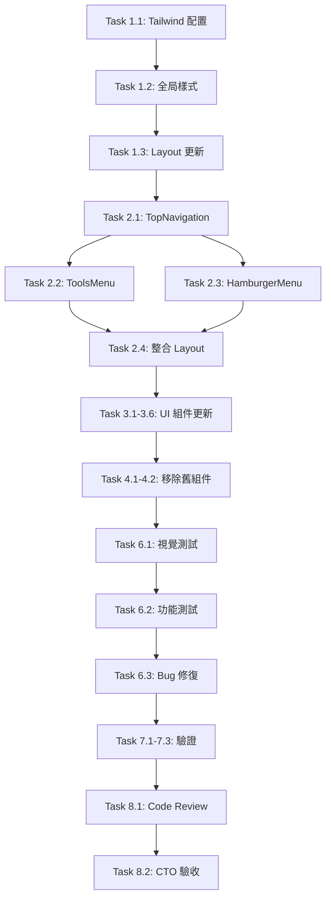

# OpenSpec Tasks: TinyWow 風格淺色主題任務分解

**專案名稱**: tools.cloudto.io 視覺主題重構
**任務文檔版本**: 1.0.0
**建立日期**: 2025-10-28
**CTO**: Antarose CTO
**狀態**: ✅ 設計已批准，待執行

---

## 任務總覽

**總計**: 15 個任務
**預估工時**: 9 個工作日
**團隊成員**: Lisa (1天) + Waylon (5天) + Mark (2天) + QA (2天) + Lily (1天)

---

## 階段一：配置更新（Day 1）

### Task 1.1: 更新 Tailwind 配置

**負責人**: Waylon
**預估時間**: 2 小時
**優先級**: 🔴 高（阻塞其他任務）

**描述**:
更新 `tailwind.config.ts` 為 TinyWow 風格淺色主題配色。

**待修改檔案**:
- `frontend/tailwind.config.ts`

**具體變更**:
```typescript
colors: {
  primary: {
    DEFAULT: '#1A8FE3',
    hover: '#1570BD',
    light: '#E0F2FE',
  },
  text: {
    primary: '#020817',
    heading: '#181D20',
    secondary: '#6B7280',
    disabled: '#9CA3AF',
  },
  // ... (詳見 design-system-tinywow.md)
}
```

**驗收標準**:
- [ ] Tailwind 配置無語法錯誤
- [ ] `npm run dev` 編譯成功
- [ ] 新色彩變數可在組件中使用

---

### Task 1.2: 更新全局樣式

**負責人**: Waylon
**預估時間**: 1.5 小時
**優先級**: 🔴 高

**描述**:
更新 `app/globals.css` 為淺色主題，移除深色模式樣式。

**待修改檔案**:
- `frontend/app/globals.css`

**具體變更**:
- 更新 `:root` CSS 變數為淺色
- 移除 `.dark` 類別配置
- 新增虛線邊框 utility class
- 更新滾動條樣式（淺色）

**驗收標準**:
- [ ] CSS 變數定義完整
- [ ] 頁面背景為白色
- [ ] 無 CSS 錯誤或警告

---

### Task 1.3: 更新 Layout 根組件

**負責人**: Waylon
**預估時間**: 1 小時
**優先級**: 🔴 高

**描述**:
移除 `layout.tsx` 中的深色模式強制設定，改為淺色主題。

**待修改檔案**:
- `frontend/app/[locale]/layout.tsx`

**具體變更**:
```typescript
// 移除
<html className="dark">

// 改為
<html>

// 更新 body 樣式
<body className="bg-white text-text-primary">
```

**驗收標準**:
- [ ] 頁面不再強制深色模式
- [ ] 背景為白色
- [ ] 文字為黑色

---

## 階段二：頂部導航開發（Day 2-3）

### Task 2.1: 實作 TopNavigation 組件

**負責人**: Waylon
**預估時間**: 4 小時
**優先級**: 🔴 高

**描述**:
創建新的頂部導航組件，取代側邊欄設計。

**待創建檔案**:
- `frontend/components/NavBar/TopNavigation.tsx`

**功能需求**:
- 固定頂部（`fixed top-0`）
- Logo 在左側
- 工具選單在中間（Desktop）/ 漢堡選單（Mobile）
- 語言切換在右側
- 白色背景 + 淡陰影

**技術規格**:
- 高度：Desktop 64px / Mobile 56px
- 背景：`bg-white shadow-nav`
- 最大寬度：`max-w-7xl`
- Z-index：`z-50`

**驗收標準**:
- [ ] Desktop 顯示完整工具選單
- [ ] Mobile 顯示漢堡選單
- [ ] Logo 可點擊返回首頁
- [ ] 導航固定在頂部不隨頁面滾動

---

### Task 2.2: 實作 ToolsMenu 組件

**負責人**: Waylon
**預估時間**: 2 小時
**優先級**: 🟡 中

**描述**:
創建工具選單組件，橫向顯示所有工具分類。

**待創建檔案**:
- `frontend/components/NavBar/ToolsMenu.tsx`

**功能需求**:
- 橫向排列工具（去背、壓縮、裁切、轉換）
- 當前頁面高亮顯示
- Hover 效果

**技術規格**:
- 按鈕樣式：`px-4 py-2 rounded-lg`
- 活躍狀態：`bg-primary text-white`
- 非活躍：`text-text-primary hover:bg-background-hover`

**驗收標準**:
- [ ] 工具切換正常
- [ ] 當前工具正確高亮
- [ ] Hover 效果流暢

---

### Task 2.3: 實作 HamburgerMenu 組件（Mobile）

**負責人**: Waylon
**預估時間**: 3 小時
**優先級**: 🟡 中

**描述**:
創建 Mobile 漢堡選單，展開後顯示工具列表。

**待創建檔案**:
- `frontend/components/NavBar/HamburgerMenu.tsx`

**功能需求**:
- 漢堡圖示按鈕
- 點擊展開/收合選單
- 選單覆蓋全螢幕或從側邊滑出
- 工具列表垂直排列

**技術規格**:
- 使用 `useState` 管理展開狀態
- 動畫：`transition-transform duration-300`
- 背景遮罩：`bg-black/50`

**驗收標準**:
- [ ] Mobile 顯示漢堡選單圖示
- [ ] 點擊可展開/收合
- [ ] 選單內工具可點擊切換
- [ ] 動畫流暢

---

### Task 2.4: 整合 TopNavigation 到 Layout

**負責人**: Waylon
**預估時間**: 1.5 小時
**優先級**: 🔴 高

**描述**:
將 TopNavigation 整合到 `layout.tsx`，移除側邊欄。

**待修改檔案**:
- `frontend/app/[locale]/layout.tsx`

**具體變更**:
```typescript
// 移除 ToolBar 導入和使用

// 加入 TopNavigation
import { TopNavigation } from '@/components/NavBar/TopNavigation';

<body>
  <TopNavigation locale={locale} />
  <main className="pt-20">  {/* 為導航欄預留空間 */}
    {children}
  </main>
</body>
```

**驗收標準**:
- [ ] 頂部導航正確顯示
- [ ] 側邊欄已移除
- [ ] 內容區域不被導航遮擋
- [ ] 多語言路由正常

---

## 階段三：UI 組件更新（Day 4-5）

### Task 3.1: 更新 Button 組件

**負責人**: Waylon
**預估時間**: 2 小時
**優先級**: 🔴 高

**待修改檔案**:
- `frontend/components/ui/button.tsx`

**具體變更**:
- 主要按鈕：純色藍色（移除漸變）
- 次要按鈕：白色 + 藍框
- 移除深色模式樣式
- 更新 hover 效果

**驗收標準**:
- [ ] 按鈕樣式符合 TinyWow 風格
- [ ] Hover 效果正確
- [ ] 所有頁面按鈕正常顯示

---

### Task 3.2: 更新 Card 組件

**負責人**: Waylon
**預估時間**: 1.5 小時
**優先級**: 🟡 中

**待修改檔案**:
- `frontend/components/ui/card.tsx`

**具體變更**:
- 移除玻璃擬態（`backdrop-blur-xl`）
- 白色背景：`bg-white`
- 淺色邊框：`border-border`
- 簡潔陰影：`shadow-card`

**驗收標準**:
- [ ] 卡片背景為白色
- [ ] 無玻璃擬態效果
- [ ] 陰影效果自然

---

### Task 3.3: 更新 Input 組件

**負責人**: Waylon
**預估時間**: 1 小時
**優先級**: 🟡 中

**待修改檔案**:
- `frontend/components/ui/input.tsx`

**具體變更**:
- 白色背景
- 淺色邊框
- Focus 狀態：藍色 ring

**驗收標準**:
- [ ] 輸入框樣式正確
- [ ] Focus 狀態清晰可見
- [ ] 無障礙對比度通過

---

### Task 3.4: 重設計 UploadCard 組件

**負責人**: Waylon
**預估時間**: 3 小時
**優先級**: 🔴 高（核心組件）

**待修改檔案**:
- `frontend/components/features/upload-card.tsx`

**具體變更**:
- **虛線邊框**：`border-2 border-dashed border-border`
- **白色背景**：`bg-white`
- **Hover 效果**：邊框變藍 + 淡藍背景
- **拖拽狀態**：實線藍框 + 藍色背景
- **按鈕樣式**：實心藍色主按鈕

**驗收標準**:
- [ ] 虛線邊框正確顯示
- [ ] Hover 效果符合設計
- [ ] 拖拽功能正常
- [ ] 按鈕樣式正確

---

### Task 3.5: 更新 PreviewCanvas 組件

**負責人**: Waylon
**預估時間**: 2 小時
**優先級**: 🟡 中

**待修改檔案**:
- `frontend/components/features/preview-canvas.tsx`

**具體變更**:
- 白色卡片背景
- 藍色按鈕
- 調整間距和留白

**驗收標準**:
- [ ] 預覽區域樣式正確
- [ ] 對比滑桿功能正常
- [ ] 下載按鈕樣式正確

---

### Task 3.6: 更新 UploadSection 組件

**負責人**: Waylon
**預估時間**: 1.5 小時
**優先級**: 🟡 中

**待修改檔案**:
- `frontend/components/features/upload-section.tsx`

**具體變更**:
- 背景色：`bg-gray-50`（淺灰）
- 增加 padding 和留白
- 內容區域居中

**驗收標準**:
- [ ] 佈局清晰
- [ ] 留白適當
- [ ] 響應式正常

---

## 階段四：移除舊組件（Day 5）

### Task 4.1: 移除側邊欄組件

**負責人**: Waylon
**預估時間**: 1 小時
**優先級**: 🟡 中

**待刪除檔案**:
- `frontend/components/ToolBar/DesktopToolBar.tsx`
- `frontend/components/ToolBar/MobileTabBar.tsx`（視情況保留或重構）
- `frontend/components/ToolBar/index.tsx`

**待修改檔案**:
- 所有引用 ToolBar 的組件

**驗收標準**:
- [ ] 側邊欄組件完全移除
- [ ] 無 import 錯誤
- [ ] 編譯成功

---

### Task 4.2: 移除工具列狀態管理

**負責人**: Waylon
**預估時間**: 0.5 小時
**優先級**: 🟡 中

**待刪除檔案**:
- `frontend/stores/toolbarStore.ts`

**待修改檔案**:
- 移除所有 `useToolbarStore` 的使用

**驗收標準**:
- [ ] Store 檔案已刪除
- [ ] 無相關 import
- [ ] 編譯成功

---

## 階段五：樣式細節優化（Day 6）

### Task 5.1: 更新工具頁面樣式

**負責人**: Waylon
**預估時間**: 2 小時
**優先級**: 🟡 中

**待修改檔案**:
- `frontend/app/[locale]/[tool]/page.tsx`

**具體變更**:
- 頁面背景：`bg-gray-50`
- 標題樣式更新
- 內容區域居中：`max-w-7xl mx-auto`

**驗收標準**:
- [ ] 所有工具頁面樣式一致
- [ ] 佈局清晰美觀

---

### Task 5.2: 更新 LanguageSelector 樣式

**負責人**: Waylon
**預估時間**: 1 小時
**優先級**: 🟢 低

**待修改檔案**:
- `frontend/components/NavBar/LanguageSelector.tsx`（如果存在）

**具體變更**:
- 下拉選單背景：白色
- 選項 hover：淺灰背景
- 邊框：淺色

**驗收標準**:
- [ ] 下拉選單樣式正確
- [ ] 語言切換功能正常

---

## 階段六：測試與修復（Day 7-8）

### Task 6.1: 執行視覺回歸測試

**負責人**: Lucia
**預估時間**: 4 小時
**優先級**: 🔴 高

**測試範圍**:
- 所有工具頁面（去背、壓縮、裁切、轉換）
- 所有斷點（Mobile, Tablet, Desktop）
- 所有語言版本（zh-tw, en, zh-cn, ja）

**測試工具**:
- Playwright (MCP tool)
- Chrome DevTools (MCP tool)

**驗收標準**:
- [ ] 所有頁面樣式正確
- [ ] 無佈局錯位
- [ ] 響應式設計正常
- [ ] 截圖對比通過

---

### Task 6.2: 執行功能測試

**負責人**: Ann
**預估時間**: 4 小時
**優先級**: 🔴 高

**測試項目**:
- 工具切換（4 個工具）
- 語言切換（4 種語言）
- 圖片上傳
- AI 處理
- 圖片下載
- IndexedDB 儲存

**測試環境**:
- Local: http://localhost:5173
- Online: https://dev-ai.cloudto.io

**驗收標準**:
- [ ] 所有功能正常
- [ ] 無 JavaScript 錯誤
- [ ] 本地測試通過
- [ ] 線上測試通過

---

### Task 6.3: Bug 修復

**負責人**: Mark
**預估時間**: 2 天
**優先級**: 🔴 高

**描述**:
修復 QA 測試發現的所有 bug。

**常見可能問題**:
- 響應式佈局問題
- 色彩對比度不足
- 按鈕樣式不一致
- 動畫效果異常

**驗收標準**:
- [ ] 所有 Critical bugs 修復
- [ ] 所有 High bugs 修復
- [ ] 重新測試通過

---

## 階段七：無障礙與 SEO 驗證（Day 9）

### Task 7.1: 無障礙對比度驗證

**負責人**: Lily
**預估時間**: 2 小時
**優先級**: 🔴 高

**驗證工具**:
- WebAIM Contrast Checker
- Chrome DevTools Accessibility

**驗證項目**:
- [ ] 主文字對比度 ≥ 4.5:1
- [ ] 大文字對比度 ≥ 3:1
- [ ] 按鈕文字對比度 ≥ 4.5:1
- [ ] 輔助文字對比度 ≥ 4.5:1

**驗收標準**:
- [ ] 所有文字符合 WCAG AA 標準
- [ ] 提供改進建議（如不通過）

---

### Task 7.2: SEO 影響評估

**負責人**: Lily
**預估時間**: 2 小時
**優先級**: 🟡 中

**評估項目**:
- [ ] 頁面結構無變化（H1, H2, meta）
- [ ] 語義 HTML 標籤使用正確
- [ ] Alt text 完整
- [ ] 內部連結結構正常

**驗收標準**:
- [ ] SEO 評分無下降
- [ ] Lighthouse SEO ≥ 95

---

### Task 7.3: 性能測試

**負責人**: Ann
**預估時間**: 2 小時
**優先級**: 🟡 中

**測試工具**:
- Lighthouse
- WebPageTest

**測試項目**:
- [ ] Performance ≥ 90
- [ ] FCP < 1.5s
- [ ] LCP < 2.5s
- [ ] CLS < 0.1

**驗收標準**:
- [ ] 所有性能指標達標
- [ ] 無性能退化

---

## 階段八：Code Review 與 CTO 驗收（Day 9）

### Task 8.1: 前端 Code Review

**負責人**: Shawn
**預估時間**: 2 小時
**優先級**: 🔴 高

**Review 重點**:
- 代碼風格一致性
- Tailwind 類名使用規範
- 組件可讀性
- 無冗餘代碼

**驗收標準**:
- [ ] 代碼符合 ESLint 規範
- [ ] 無 TypeScript 錯誤
- [ ] 組件結構清晰

---

### Task 8.2: CTO 最終驗收

**負責人**: CTO
**預估時間**: 2 小時
**優先級**: 🔴 高

**驗收項目**:
- [ ] Proposal 中的所有需求已實現
- [ ] Design 中的所有技術方案已實施
- [ ] 所有 Tasks 已完成
- [ ] QA 測試通過（本地 + 線上）
- [ ] Code Review 通過
- [ ] SEO 驗證通過
- [ ] 無障礙驗證通過

**最終產出**:
- CTO 驗收報告
- Leo 更新技術文檔（2 個工作日內）

---

## 任務依賴關係



---

## 時程規劃

| 階段 | Day | 任務 | 負責人 | 狀態 |
|------|-----|------|--------|------|
| **配置更新** | Day 1 | Task 1.1-1.3 | Waylon | ⏳ 待執行 |
| **導航開發** | Day 2-3 | Task 2.1-2.4 | Waylon | ⏳ 待執行 |
| **UI 組件** | Day 4-5 | Task 3.1-3.6 | Waylon | ⏳ 待執行 |
| **移除舊組件** | Day 5 | Task 4.1-4.2 | Waylon | ⏳ 待執行 |
| **測試** | Day 6-7 | Task 6.1-6.2 | Lucia + Ann | ⏳ 待執行 |
| **Bug 修復** | Day 7-8 | Task 6.3 | Mark | ⏳ 待執行 |
| **驗證** | Day 9 | Task 7.1-7.3 | Lily + Ann | ⏳ 待執行 |
| **Review** | Day 9 | Task 8.1-8.2 | Shawn + CTO | ⏳ 待執行 |

---

## 團隊協作流程

### 開發階段（Day 1-5）

1. **Waylon** 執行 Task 1.1-4.2
2. 每完成一個階段，commit 並 push
3. **Shawn** 即時進行 code review

### 測試階段（Day 6-7）

1. **Lucia + Ann** 執行 E2E 測試
2. 發現 bug 立即通知 **Mark**
3. **Mark** 修復 bug 並通知 QA 重測

### 驗證階段（Day 9）

1. **Lily** 執行 SEO + 無障礙驗證
2. **Ann** 執行性能測試
3. **Shawn** 執行最終 code review
4. **CTO** 執行最終驗收

---

## CTO 審批區

**審批結果**：✅ **批准**

**審批意見**：

任務分解清晰完整，15 個任務涵蓋所有變更範圍。時程規劃合理（9 天），團隊分工明確，依賴關係清楚。批准開始執行。

**審批簽名**：CTO

**審批日期**：2025-10-28

---

**✅ 任務已批准，進入 Specification Phase。**
